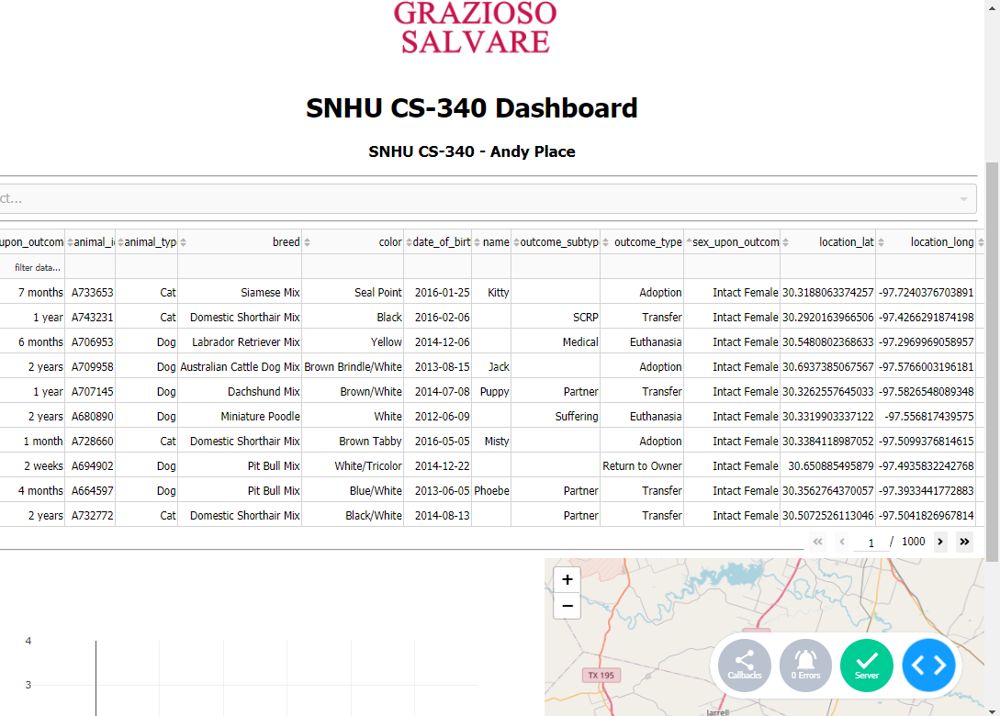
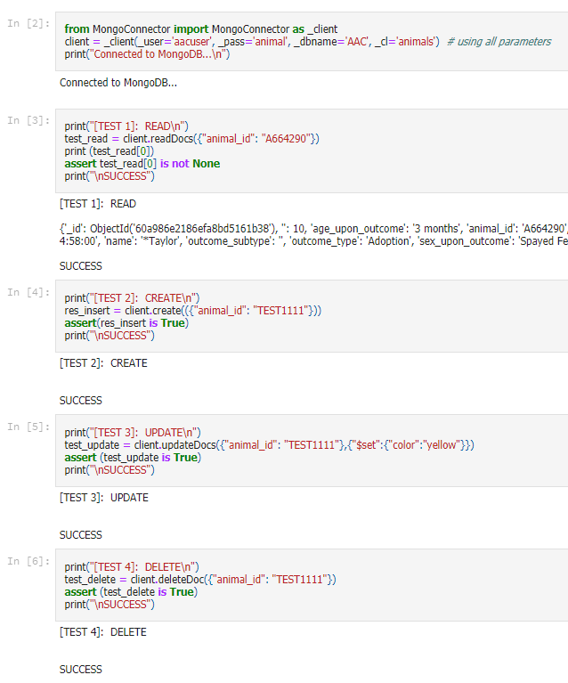

# CS-340 Repository

## The Project

## MongoDB Animal Search and Rescue API
An animal profiling tool used for finding rescue animal candidates.


<hr/>




## Motivation
...

## Getting Started:
Tools used: (Python IDE) PyCharm Professional, Sublime Text 4, MongoDB, and Python.

Required: Text editor, Python, and MongoDB for a minimal use-case.


## Installation
1) **MongoDB** [MongoDB Download](https://www.mongodb.com/try/download)

2) **Python** [Python Download](https://www.python.org/downloads/)

3) **PyMongo** [PyMongo Documentation](https://pypi.org/project/pymongo/)

4) Python Deps: { base64, dash, dash_leaflet, dash_table,jupyter_dash, pandas, numpy }


## Getting Started
For a local install, follow the installation instructions above.

**Linux** use this command import the CSV dataset.<br>
```sh
mongoimport -d AAC -c animals --type CSV --file ./aac_shelter_outcomes.csv --headerline
```

Using authentication: <br>

```sh
mongo --authenticationDatabase "AAC" -u "aacuser" -p
```

**Windows OS - PowerShell**

Alternatively, You may use MongoDB Compass to import the entire database.<br>

Note: ( You must start mongod.exe first if you use this method )

### Without authentication, binding to localhost on port 27017
```ps
.\mongod.exe --dbpath '.\storage\' --bind_ip localhost --port 27017
```
### Terminal Connection through mongo

```ps
.\mongo.exe AAC -u aacuser -p
```


### Authentication, binding to localhost on port 27017

```ps
.\mongod.exe --dbpath ./storage/ --bind_ip localhost --port 27017 --auth
```

## Usage

### Minimal MongoConnector Class Example

```Python
from MongoConnector import MongoConnector as mongo_client

# Driver
def main():

  query_ex = {"key": "value"}  # uses a dictionary

  #  Connect to a database
  shelter = mongo_client('username', 'password', 'ip', 'port', 'db', 'collection')


  #  Create new document in collection
  shelter.create(query_ex)

  #  Query where 'key' is 'value' in MongoDB, print each result.
  result = shelter.read(query_ex)
  for x in result:
    print(x)


# Main
if __name__ == '__main__':
  main()
```

## Functionality and Tests:

<hr/>


| Test  | Crud Operation         |       Result       |
| :---: | :--------------------- | :----------------: |
|   1   | Import MongoConnector  | :heavy_check_mark: |
|   2   | MongoDB Authentication | :heavy_check_mark: |
|   2   | CREATE operation       | :heavy_check_mark: |
|   3   | READ operation         | :heavy_check_mark: |
|   4   | UPDATE operation       | :heavy_check_mark: |
|   5   | DELETE operation       | :heavy_check_mark: |


## Roadmap/Features
- [x] Connects to a MongoDB server
- [x] Applies user authentication
- [x] C.R.U.D. support through python
- [x] Interfaces with GUI
- [x] Better map implementation!
- [ ] ~~Working graph~~ ¯\\_ (ツ)_/¯


## Required Prompts

## 1.) How do you write programs that are maintainable, readable, and adaptable?

```
I look at the essential requirements and implement them first.
After designing the basic structure of the project, I can add
or remove features modularly.
```

## 2.) Especially consider your work on the CRUD Python module from Project One, which you used to connect the dashboard widgets to the database in Project Two.

```
The MongoConnector class I created that interfaces with MongoDB
is an abstract design. This allows one to quickly modify this
class to their needs without worrying about breaking all of the
code or making significant changes.
```

## 3.) What were the advantages of working in this way? How else could you use this CRUD Python module in the future?

```
I have already implemented this python class in a separate project.
Instead of hard-coding the values, I created a configuration file in
JSON which is read by python. Since the CRUD module is modular,
it can be simply be imported and applied do different projects.
```

## 4.) How do you approach a problem as a computer scientist?

```
As a software engineer, I approach each project with the main intention
of creating the foundation of a program first, and then applying features
as I continue to work. I have implemented CRUD before in other courses, in
Java to be specific. The only difference is quality. Since we used Jupyter,
we needed additional dependencies. Issues in the code were significantly more
troublesome to identify since it is also Python and third-party libraries.
```

## 5.) What do computer scientists do, and why does it matter?

```
Usually, a computer or data scientist would take the information and statistics
and provide insight based off their findings. I cannot say the approach was similar,
though it was ambitious. There is a table, a graph, and a map. I am not sure this
would be enough information to draw any definitive conclusions regarding this dataset.

From a software engineering perspective, my job is to simplify and automate boring
and otherwise tedious tasks. If a company required a database or front-end application
to interact with one, nothing more, this would be beneficial.
```

Contact Information:
- Name: Andrew Place
- Main Email: MrTinklesworth@gmail.com
- EDU Email: andrew.place1@snhu.edu
